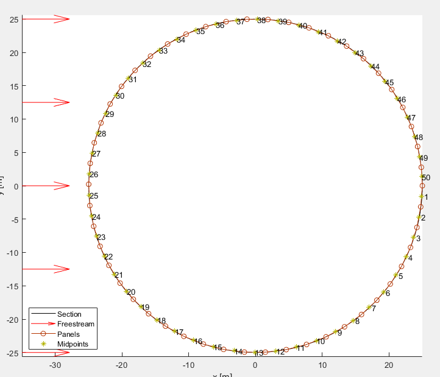

# Panel Method in MATLAB
An implementation of the panels method for aerodynamic calculations for MATLAB. The code is part of a university assignment (Universitat Politécnica de València), and can be further improved as the code is not optimized.

__Authors:__
* Martínez Ibáñez, Josep Balbino
* Matoses Gimenez, Andreu
* Ortiz Moya, Álvaro
* Ruiz López, Álvaro
* Soriano Pascual, Fernando

Two different panel methods are implemented, one for bodies that generate no lift,
using only sources and sinks, and another one where circulation is taken into account,
which can provide an approximation for the lift.
The panel method is implemented in a user friendly GUI which allows to obtain a wide
variety of results.

## Instructions on how to run the Panels method GUI
1. Open GUI_Panels_method type MATLAB Code file (Do not open the type MATAB Figure as it will not work correctly due 
to some variables that need to be defined with the Code file) *IMPORTANT!!!*

1. Once the MATLAB program has been correctly opened, click on the RUN button and the GUI object will open. You can now start using it.

## How to use the GUI
First, it can be seen on figure *GUIOverall* how the overall program looks like.

 

In order to continue a geometry has to be selected, it can be done by clicking on the select geometry button, see figure *GUIGeo*, and then a folder to select the file will open. Now it is important to select a valid .stl file that are stored in the folder 3dModels, in case an invalid file is selected a display message will say so and on the other hand the geometry will appear in the plot area on the right.

Once a valid geometry is selected, the preprocessing steps begin with selecting the 2D cut of the geometry to be analyzed. In this part the cutting plane must be defined with a point and a vector that it can be specified on their correspondent boxes. The cutting planes can be seen on the plot area, see figure *GUICut*, in this case it can be seen a cut through the xy axis in [0,0,0] on a sphere.

After a valid cut can be performed, the Cut section button will be unlocked and on pressing it the section will appear on the plot area, see figure *GUISece*, also in the section panel basic translations and rotations of the section can be performed, see figure *GUISecp*.

Now it its the time to discretize the section, on the section below it can be specified the number of panels in which divide the section and the slope sensitivity, meaning that if this value is increased, more panels will be assigned to areas with high slope in order to improve the calculations. A recommended number of panel for the airfoils is more than 200. Then by pressing discretize, the section with its panels will appear in the plot area, see figure *GUIDis* and the solver will be unlocked.

In the solver section, two types can be chosen. The first one is Sources and sinks and is used for non-lift cases and the other is Sources, sinks and vortexes and this one is for cases where there is lift. Note that here the flow speed can be set and for the lift solver it can also be specified the angles of attack of the flow, see figure *GUISol*.

Now for the sphere case the non lifting flow will be the one to choose but for an airfoil it should be the other one. When it is all set the case can be solved and the post processing begins. In this area graphs and contours can be plotted. In the graph section the the cp or the cl can be plotted and in the case of the lifting flow choose which angles to plot, see figure *GUIGra*. In the contour section it can be plotted the streamlines, and which number to plot, and or the velocity, in absolute or its components, or pressure contours. There is also the option of choosing the size of these contour plots, see figure *GUICon*.

Finally it can be seen on figures *GUIScl* and *GUIAcl* some graphs and in figures *GUISC* and *GUIAC* some contour plots. Remark that it is possible to modify the view of the plots and save both plots and solutions with the buttons of the right bottom corner.

